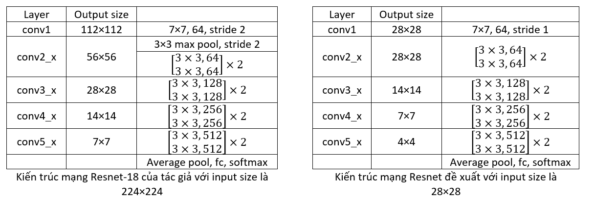

# Fashion-MNIST
Fashion-MNIST with SVM, Multilayer Perceptron and ResNet

## 1. SVM và PCA
Mô hình SVM có rất nhiều loại kernel khác nhau. Ở đây, tôi chọn dùng Polynominal kernel.
Trước khi đưa vào mô hình học, chúng ta cần giảm số chiều dữ liệu (ban đầu là 28×28=784 chiều). Qua nhiều lần thực nghiệm, tôi nhận thấy rằng, số chiều dữ liệu ta giữ lại sau khi PCA có ảnh hưởng nhiều đến độ chính xác của bộ phân lớp SVM, cụ thể như sau:
| Số chiều PCA giữ lại | Độ chính xác trên tập test |
| ------------- | ------------- |
| 30  | 0.869  |
| 50  | 0.881  |
| 100 | 0.888  |
| 200	| 0.892  |
| 300	| 0.893  |
| 400	| 0.892  |
| 500	| 0.892  |

Khi số chiều ta giữ lại sau khi PCA là quá thấp thì độ chính xác của mô hình SVM cũng giảm đi đáng kể. Mô hình SVM đạt độ chính xác cao nhất trên tập test với số chiều của dữ liệu là 300. Lúc này, độ chính xác của mô hình SVM trên tập train là 0.917, độ chính xác trên tập test là 0.893.

## 2. Multilayer Perceptron
Đầu tiên, ảnh input sẽ được làm phẳng ra thành mảnh một chiều gồm 784 pixels. Sau đó, mô hình gồm có 3 lớp ẩn đều là các fully-connected layer. Hàm kích hoạt là sigmoid. Cuối cùng, một lớp softmax được thêm vào sau lớp output để chuẩn hóa đầu ra thành phân phối xác suất của 10 lớp trong tập dữ liệu.
|Layer|	Số nốt|
| ------------- | ------------- |
|Input	|784|
|Hidden layer 1	|1000|
|Hidden layer 1	|256|
|Hidden layer 1	|64|
|Output	|10

Kết quả đánh giá mô hình như sau:

Trên tập train
|Loss|Accuracy|
| ------------- | ------------- |
|0.1762|0.9335|

Trên tập test
|Loss|Accuracy|
| ------------- | ------------- |
|0.2900|0.8980|

## 3. ResNet-18
Do độ lớn của bài toán, tôi sẽ chỉ dùng mô hình ResNet-18, như trong bài báo [Deep Residual Learning for Image Recognition](https://arxiv.org/abs/1512.03385). Tuy nhiên, do kích thước ban đầu của ảnh đã khá nhỏ (28x28) nên tôi đã lược bỏ đi một lớp max-pool ở đầu mô hình, đồng thời ở lớp conv đầu tiên cũng giảm stride từ 2 xuống 1. 

Kết quả đánh giá mô hình như sau:

Trên tập train
|Loss|Accuracy|
| ------------- | ------------- |
|0.1118|0.9600|

Trên tập test
|Loss|Accuracy|
| ------------- | ------------- |
|0.1904|0.9316|

